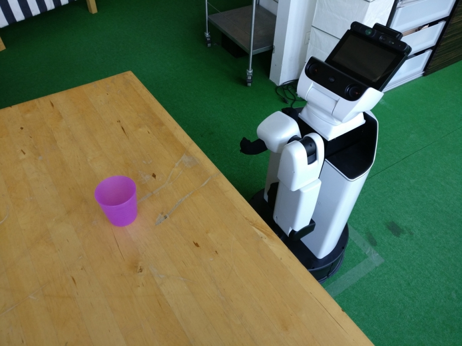
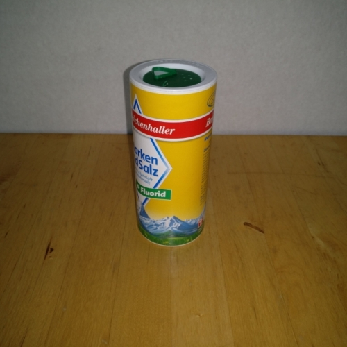
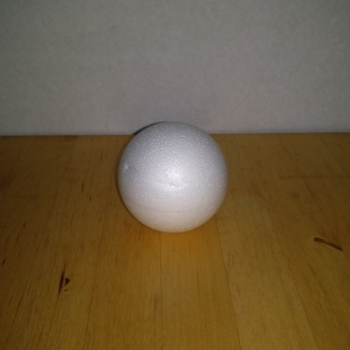
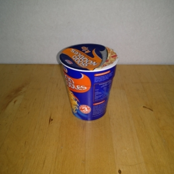
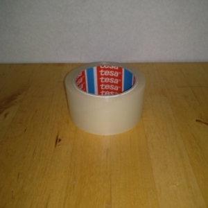
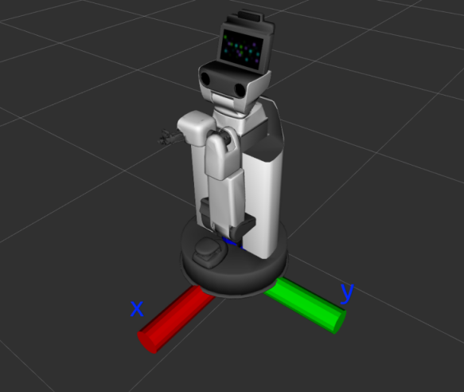

# Experimental report 28.07.2018

|                                      |                                       |
|--------------------------------------|---------------------------------------|
| Date & Time                          | 28.07.2018, 17:00 - 21:00             |
| Experimenter                         | Minh Nguyen, Alex Mitrevski           |
| User Account                         | lucy@192.168.50.201                   |
| Hardware configuration               | Toyota HSR                            |
| Tested feature                       | Domestic object grasping              |
| Test setup / environment             | HBRS, C069 lab                        |

## Experiment description

The purpose of this experiment is to evaluate the performance of a baseline grasp planner for grasping common domestic objects, which uses a fixed grasping orientation and a position determined by averaging the points of an object's point cloud.

## Assumptions

* All robot components are working correctly (no internal faults)
* The experiment is performed under normal room lighting conditions, which are potentially changing during the experiment (e.g. a light going off or the weather changing between sunny and cloudy)
* The position of an object is kept fixed during grasp planning and grasp execution (i.e. there is no malicious external agent that moves the object during an experimental trial)

## Experimental procedure

The experimental setup is as follows:

* The robot grasps objects from the dining room table in C069
* In the experiment, there is a single object on the table at a time that the robot needs to grasp

* Only the following objects are used for the experiment: a salt box, a ball, a noodle box, and duct tape (shown below)

* For recognising objects, an SSD detector trained on the COCO dataset is used; since the detector is not trained on our particular object set, the salt box is detected as either a bottle or a cup, the ball is detected as either an orange or an apple, the noodle box is detected as a cup, and the duct tape is detected as a bowl.
* Before the experiment, the distance from the robot to the nearest table edge is fixed; however, the robot aligns itself with the position of an object before grasping it and may move forward to approach the object if it is too far away.
* The position of the object on the table is arbitrary, but is kept within 35cm from the edge nearest to the robot so that reachability is always ensured.
* We ignore object detections if the estimated object position is further than 90cm along x and below 75cm along z with respect to the `base_link` frame. The `base_link` frame is shown in the figure below.

* For each object, we repeat a grasp 20 times (once for 20 different positions of the object). A trial is considered successful if the robot picks an object and the object stays within the gripper after the arm is moved back. Trials in which the arm collides with the table or the object slips out of the gripper are considered unsuccessful. Grasping motions are performed using a prerecorded dynamic motion primitive.

## Results

| Object      | Success   | Slip      | Fail      | Comments
|-------------|-----------|-----------|-----------|-------------------------------------------------------------|
| Salt        | 17        | 0         |  3        | failures due to the object slipping out of the gripper
| Light ball  |  8        | 0         | 12        | failures due to the ball being pushed away while grasping or the arm colliding with the table
| Noodle box  | 16        | 0         |  4        | failures due to collisions with the table
| Duct tape   |  7        | 0         | 13        | failures due to collisions with the table; in five of the failed trials, the object was successfully grasped

# Observations

* The minimum height (with respect to the `base_link` frame) is set to the height of the table (0.78m); any calculated pose lower than that is adjusted to this height.
* The maximum allowed distance along x from the robot to an object is 80cm; any calculated position larger than that is adjusted to 80cm. In addition, the x position is offset 4cm to account for the gripper frame being at the back of the gripper.
* Objects sometimes slip through the robot's gripper; it is thus necessary to integrate grasp verification into the grasping procedure.
* Over time, the pose estimate from the camera seems to degrade; this might be due to the camera overheating or going to autofocus mode after a drastic light change (e.g. the light turns off).
* When an object is placed closer to the robot, the pose estimate is consistently worse than when the object is further away

# Media

A video of the noodle box grasping trials can be seen [here](https://www.youtube.com/watch?v=OC7vttt4-Jo).
